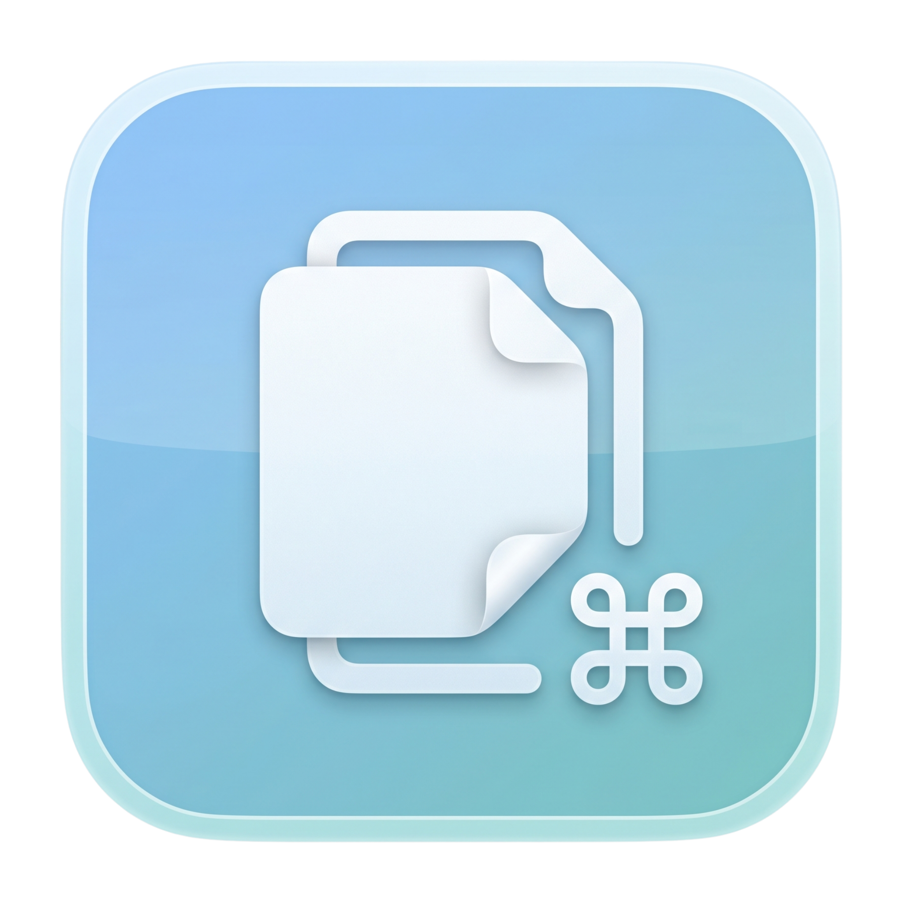

# WhatsCopy

<p align="center">
  
</p>

Restore ⌘C for selected text in WhatsApp for Mac.

WhatsCopy is a small, privacy-first macOS menu-bar utility for cases where WhatsApp for Mac disables or breaks its normal Edit > Copy behavior. It listens for Command-C, checks whether WhatsApp is the frontmost app, asks macOS Accessibility for the text you actively selected, and writes that selected text to the system clipboard.

WhatsCopy is unofficial open-source software. It is not affiliated with WhatsApp, Meta, or any related company.

## What It Does

- Runs as a lightweight menu-bar-only macOS app.
- Restores Command-C for selected text exposed by WhatsApp through macOS Accessibility.
- Leaves Command-C alone in every other app.
- Passes Command-C through when no selected text can be read.
- Includes menu controls for enable/disable, Launch at Login, Accessibility setup, version info, and About.

## Privacy

WhatsCopy is intentionally narrow:

- No analytics.
- No telemetry.
- No tracking.
- No network access.
- No WhatsApp database access.
- No message scraping.
- No reading chat history, files, private app storage, or network traffic.
- Only selected text is copied when you press Command-C while WhatsApp is frontmost.

## Build And Run

Requirements:

- macOS 13 or newer
- Xcode with Swift 5.9 or newer

Build from the command line:

```sh
swift build
```

Run from the command line:

```sh
swift run WhatsCopy
```

You can also open the package in Xcode and run the `WhatsCopy` executable product.

## Release DMG

Open source is useful for transparency and developer builds, but it does not remove macOS Gatekeeper checks for downloaded apps. For normal users, publish a signed and notarized `WhatsCopy.dmg` from GitHub Releases.

Create an unsigned local test package:

```sh
./scripts/package-release.sh
```

This creates:

```text
dist/WhatsCopy.app
dist/WhatsCopy.dmg
```

The packaged app uses `Assets/whatscopy-logo.png` for its app icon and includes the logo in `Contents/Resources`.

The unsigned DMG is useful for local packaging checks, but users may see Gatekeeper warnings if they download it from the internet.

Create a signed DMG without notarizing:

```sh
DEVELOPER_ID_APPLICATION="Developer ID Application: Your Name (TEAMID)" \
./scripts/package-release.sh
```

Create a signed and notarized release DMG:

```sh
DEVELOPER_ID_APPLICATION="Developer ID Application: Your Name (TEAMID)" \
APPLE_ID="you@example.com" \
APPLE_TEAM_ID="TEAMID" \
APP_SPECIFIC_PASSWORD="xxxx-xxxx-xxxx-xxxx" \
NOTARIZE=1 \
./scripts/package-release.sh
```

Optional release metadata:

```sh
BUNDLE_ID="dev.whatscopy.WhatsCopy" VERSION="0.1.0" BUILD_NUMBER="1" ./scripts/package-release.sh
```

After a signed release, maintainers should verify:

```sh
codesign --verify --deep --strict --verbose=2 dist/WhatsCopy.app
spctl --assess --type execute --verbose dist/WhatsCopy.app
xcrun stapler validate dist/WhatsCopy.dmg
```

## Accessibility Permission

WhatsCopy needs Accessibility permission because macOS only exposes selected text in another app through Accessibility APIs.

1. Launch WhatsCopy.
2. Open the WhatsCopy menu-bar icon.
3. Choose `Open Accessibility Settings` or `Check Accessibility Permission`.
4. Enable WhatsCopy in System Settings > Privacy & Security > Accessibility.
5. Restart WhatsCopy if macOS requires it.

## Manual Test Checklist

1. Build and run WhatsCopy.
2. Grant Accessibility permission in System Settings.
3. Open WhatsApp for Mac.
4. Select part of a message.
5. Press ⌘C.
6. Paste into Notes or TextEdit.
7. Confirm the selected text was copied.
8. Confirm ⌘C still works normally in Safari, Chrome, TextEdit, VS Code, Finder, and other apps.
9. Confirm WhatsCopy does nothing when no text is selected.

## Known Limitations

- WhatsCopy depends on WhatsApp exposing selected text through macOS Accessibility.
- If WhatsApp does not expose selected text, WhatsCopy may not be able to copy it.
- WhatsCopy only handles actively selected text; it does not inspect message databases or chat history.
- A future fallback may support WhatsApp Web through a browser extension.

## Troubleshooting

- If nothing copies, confirm WhatsCopy has Accessibility permission.
- If permission was just granted, quit and relaunch WhatsCopy.
- If copying still fails in WhatsApp, WhatsApp may not be exposing that selected text through Accessibility.
- If Command-C behaves unexpectedly elsewhere, turn off the `Enabled` menu item or quit WhatsCopy.

## Contributing

Contributions are welcome. See [CONTRIBUTING.md](CONTRIBUTING.md) for local setup, test expectations, and project guidelines.

## Security

Please report security concerns privately. See [SECURITY.md](SECURITY.md).

## License

MIT. See [LICENSE](LICENSE).
